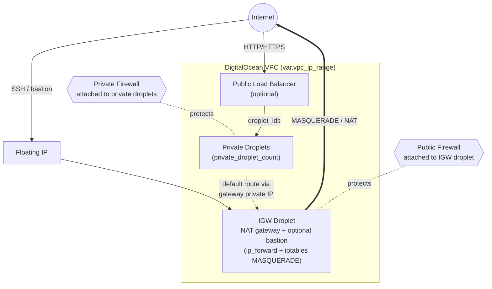

<div align="center">
  <h3>terraform-digitalocean-droplet</h3>
  <p>Terraform module to build a Digitalocean droplet</p>
  <p>
    <!-- Build Status -->
    <a href="https://actions-badge.atrox.dev/hansohn/terraform-digitalocean-droplet/goto?ref=main">
      
    </a>
    <!-- Github Tag -->
    <a href="https://gitHub.com/hansohn/terraform-digitalocean-droplet/tags/">
      
    </a>
    <!-- License -->
    <a href="https://github.com/hansohn/terraform-digitalocean-droplet/blob/main/LICENSE">
      
    </a>
  </p>
</div>

## :open_book: Usage

```hcl
module "droplet" {
  source  = "hansohn/droplet/digitalocean"
  version = "~> 2.0"

  name = "example-dev"
  tags = ["example", "dev"]

  # vpc
  vpc_region   = "sfo3"
  vpc_ip_range = "10.10.10.0/24"

  # internet gateway (NAT) droplet
  igw_droplet_image = "ubuntu-22-04-x64"

  # private droplets routed through the gateway
  private_droplet_image = "ubuntu-22-04-x64"
  private_droplet_count = 1
}
```

Authenticate by exporting `DIGITALOCEAN_TOKEN` (used by both the Terraform provider and
`doctl`). See the [complete example](examples/complete) for the full set of inputs.


### Makefile

I've included the following make targets for convenience:

```
Available targets:

  clean                               Clean everything
  dev                                 Run local dev env
  help                                Help screen
  help/all                            Display help for all targets
  help/short                          This help short screen
```

## :building_construction: Architecture

This module provisions a **private-by-default droplet topology behind a NAT/"internet
gateway" droplet** inside a DigitalOcean VPC. Private droplets have no direct public
egress path of their own; instead they route outbound traffic through the gateway
droplet, which performs NAT. An optional public load balancer fronts the private
droplets for inbound web traffic, and an optional bastion role on the gateway provides
hardened SSH ingress.



### How it works

- **VPC** — all resources are created inside a `digitalocean_vpc` scoped to `var.vpc_ip_range`.
- **Internet gateway (NAT)** — the gateway droplet is bootstrapped via cloud-init to enable
  `net.ipv4.ip_forward` and install a persistent iptables `MASQUERADE` rule for the VPC
  range, turning it into the egress point for the subnet. A `digitalocean_floating_ip` is
  attached to give it a stable public address.
- **Private droplets** — each private droplet's cloud-init rewrites its **default route** to the
  gateway droplet's private IPv4 (`ipv4_address_private`) and pins a route to the DO metadata
  endpoint (`169.254.169.254`), so all outbound internet traffic transits the gateway.
- **Public load balancer** *(optional)* — when enabled, a `digitalocean_loadbalancer` distributes
  inbound HTTP/HTTPS to the private droplets (`droplet_ids`), with its own firewall block that
  denies by default and allows your detected public IP plus any `public_lb_firewall_allow` entries.
- **Firewalls** — the **public firewall** attaches to the *gateway* droplet and the **private
  firewall** attaches to the *private* droplets. When `firewall_allow_myip_ssh` / `firewall_allow_myip_web`
  are set, the module resolves your caller IP via `https://ipinfo.io/ip` (`data.http.myip`) and
  auto-allows it. Bastion/LB source rules are derived automatically (e.g. private droplets accept
  SSH from the `igw`-tagged gateway and from the load balancer's IPs).
- **Bastion** *(optional)* — with `igw_droplet_enable_bastion`, the gateway additionally installs
  and configures `fail2ban`; `igw_droplet_enable_notifications` wires fail2ban bans to a Slack
  webhook (`slack_*` inputs).
- **SSH keys** — the [`ssh-key`](modules/ssh-key) submodule either generates a new key pair or
  imports an existing public key, and its fingerprint is attached to every droplet.
- **Project grouping** *(optional)* — with `enable_project`, a `digitalocean_project` is created and
  all droplets, volumes, and the floating IP are associated with it.
- **Block storage** *(optional)* — `enable_igw_volume` / `enable_private_volume` attach
  `digitalocean_volume` block storage to the gateway and/or private droplets.

### Feature toggles

| Input | Default | Description |
|-------|---------|-------------|
| `enabled` | `true` | Master switch for the module. When `false`, no resources are created. |
| `enable_internet_gateway` | `true` | Create the NAT/gateway droplet and its floating IP. Set `false` for gateway-less private droplets (no NAT egress). |
| `enable_public_lb` | `false` | Front the private droplets with a public load balancer. |
| `enable_project` | `true` | Wrap all resources in a DigitalOcean project. |
| `igw_droplet_enable_bastion` | `false` | Harden the gateway as an SSH bastion (fail2ban). |
| `igw_droplet_enable_notifications` | `false` | Send fail2ban ban notifications to Slack. |
| `enable_igw_volume` | `false` | Attach block storage to the gateway droplet. |
| `enable_private_volume` | `false` | Attach block storage to each private droplet. |
| `firewall_allow_myip_ssh` | `false` | Auto-allow your detected public IP for SSH. |
| `firewall_allow_myip_web` | `false` | Auto-allow your detected public IP for HTTP/HTTPS. |
| `private_droplet_count` | `1` | Number of private droplets to create behind the gateway. |

> See the generated [Inputs](#inputs) table below for the full set of variables and their defaults.

## :octocat: Examples

Please see the sample set of examples below for a better understanding of implementation

- [Complete](examples/complete) - Complete Example

<!-- BEGIN_TF_DOCS -->
## Inputs

| Name | Description | Type | Default | Required |
| ---- | ----------- | ---- | ------- | :------: |
| <a name="input_algorithm"></a> [algorithm](#input\_algorithm) | SSH key algorithm. One of RSA, ECDSA, or ED25519. | `string` | `"ED25519"` | no |
| <a name="input_ecdsa_curve"></a> [ecdsa\_curve](#input\_ecdsa\_curve) | (Optional) When algorithm is 'ECDSA', the name of the elliptic curve to use. May be any one of 'P224', 'P256', 'P384' or 'P521', with 'P224' as the default. | `string` | `null` | no |
| <a name="input_enable_igw_volume"></a> [enable\_igw\_volume](#input\_enable\_igw\_volume) | Boolean controlling whether a volume will be created and attached to the internet gateway instnace | `bool` | `false` | no |
| <a name="input_enable_internet_gateway"></a> [enable\_internet\_gateway](#input\_enable\_internet\_gateway) | (Optional) Enable creation of Internet Gateway resources. Defaults to true. | `bool` | `true` | no |
| <a name="input_enable_private_volume"></a> [enable\_private\_volume](#input\_enable\_private\_volume) | Boolean controlling whether a volume will be created and attached to the private instnace(s) | `bool` | `false` | no |
| <a name="input_enable_project"></a> [enable\_project](#input\_enable\_project) | (Optional) A boolean flag to enable/disable Project resource creation. Defaults to true. | `bool` | `true` | no |
| <a name="input_enable_public_lb"></a> [enable\_public\_lb](#input\_enable\_public\_lb) | (Optional) A boolean flag to enable/disable Load Balancer resource creation. Defaults to false. | `bool` | `false` | no |
| <a name="input_enabled"></a> [enabled](#input\_enabled) | Set to false to prevent the module from creating any resources. | `bool` | `true` | no |
| <a name="input_firewall_allow_myip_ssh"></a> [firewall\_allow\_myip\_ssh](#input\_firewall\_allow\_myip\_ssh) | (Optional) Allow your external ip ssh inbound permissions to the internet gateway. | `bool` | `false` | no |
| <a name="input_firewall_allow_myip_web"></a> [firewall\_allow\_myip\_web](#input\_firewall\_allow\_myip\_web) | (Optional) Allow your external ip port 80/443 inbound permissions to the private droplets. | `bool` | `false` | no |
| <a name="input_generate_ssh_key"></a> [generate\_ssh\_key](#input\_generate\_ssh\_key) | If set to `true`, a new SSH key pair is generated and `ssh_public_key_file` is ignored. Conflicts with ssh\_public\_key\_file. WARNING: the generated private key is stored in Terraform state in plaintext (and written to disk when local\_download\_enabled is true); for production prefer importing a public key via `ssh_public_key_file` or referencing an existing key via `ssh_key_name`. | `bool` | `false` | no |
| <a name="input_igw_droplet_backups"></a> [igw\_droplet\_backups](#input\_igw\_droplet\_backups) | (Optional) Boolean controlling if backups are made. Defaults to false. | `bool` | `null` | no |
| <a name="input_igw_droplet_cloudinit_parts"></a> [igw\_droplet\_cloudinit\_parts](#input\_igw\_droplet\_cloudinit\_parts) | (Optional) List of nested block types which adds a file to the generated cloud-init configuration. Use multiple part blocks to specify multiple files, which will be included in order of declaration in the final MIME document. | `list(any)` | `[]` | no |
| <a name="input_igw_droplet_enable_bastion"></a> [igw\_droplet\_enable\_bastion](#input\_igw\_droplet\_enable\_bastion) | (Optional) Boolean controlling whether to enable bastion ssh feature on droplet | `bool` | `false` | no |
| <a name="input_igw_droplet_enable_notifications"></a> [igw\_droplet\_enable\_notifications](#input\_igw\_droplet\_enable\_notifications) | (Optional) Boolean controlling whether to enable slack notifications. Currently this feature only applies to bastion fail2ban sshd jail notifications. | `bool` | `false` | no |
| <a name="input_igw_droplet_image"></a> [igw\_droplet\_image](#input\_igw\_droplet\_image) | (Required) The Droplet image ID or slug. | `string` | `null` | no |
| <a name="input_igw_droplet_ipv6"></a> [igw\_droplet\_ipv6](#input\_igw\_droplet\_ipv6) | (Optional) Boolean controlling if IPv6 is enabled. Defaults to false. | `bool` | `null` | no |
| <a name="input_igw_droplet_monitoring"></a> [igw\_droplet\_monitoring](#input\_igw\_droplet\_monitoring) | (Optional) Boolean controlling whether monitoring agent is installed. Defaults to false. | `bool` | `true` | no |
| <a name="input_igw_droplet_name"></a> [igw\_droplet\_name](#input\_igw\_droplet\_name) | (Required) The Droplet name. | `string` | `null` | no |
| <a name="input_igw_droplet_resize_disk"></a> [igw\_droplet\_resize\_disk](#input\_igw\_droplet\_resize\_disk) | (Optional) Boolean controlling whether to increase the disk size when resizing a Droplet. It defaults to true. When set to false, only the Droplet's RAM and CPU will be resized. Increasing a Droplet's disk size is a permanent change. Increasing only RAM and CPU is reversible. | `bool` | `null` | no |
| <a name="input_igw_droplet_size"></a> [igw\_droplet\_size](#input\_igw\_droplet\_size) | (Required) The unique slug that indentifies the type of Droplet. | `string` | `"s-1vcpu-1gb"` | no |
| <a name="input_igw_droplet_ssh_keys"></a> [igw\_droplet\_ssh\_keys](#input\_igw\_droplet\_ssh\_keys) | (Optional) A list of SSH IDs or fingerprints to enable in the format [12345, 123456]. | `list(string)` | `[]` | no |
| <a name="input_igw_droplet_tags"></a> [igw\_droplet\_tags](#input\_igw\_droplet\_tags) | (Optional) A list of the tags to be applied to this Droplet. | `list(string)` | `[]` | no |
| <a name="input_igw_droplet_volume_ids"></a> [igw\_droplet\_volume\_ids](#input\_igw\_droplet\_volume\_ids) | (Optional) - A list of the IDs of each block storage volume to be attached to the Droplet. | `list(string)` | `null` | no |
| <a name="input_igw_volume_description"></a> [igw\_volume\_description](#input\_igw\_volume\_description) | (Optional) A free-form text field up to a limit of 1024 bytes to describe a block storage volume. | `string` | `null` | no |
| <a name="input_igw_volume_initial_filesystem_label"></a> [igw\_volume\_initial\_filesystem\_label](#input\_igw\_volume\_initial\_filesystem\_label) | (Optional) Initial filesystem label for the block storage volume. | `string` | `null` | no |
| <a name="input_igw_volume_initial_filesystem_type"></a> [igw\_volume\_initial\_filesystem\_type](#input\_igw\_volume\_initial\_filesystem\_type) | (Optional) Initial filesystem type (xfs or ext4) for the block storage volume. | `string` | `null` | no |
| <a name="input_igw_volume_name"></a> [igw\_volume\_name](#input\_igw\_volume\_name) | (Required) A name for the block storage volume. Must be lowercase and be composed only of numbers, letters and '-', up to a limit of 64 characters. | `string` | `null` | no |
| <a name="input_igw_volume_size"></a> [igw\_volume\_size](#input\_igw\_volume\_size) | (Required) The size of the block storage volume in GiB. If updated, can only be expanded. | `number` | `null` | no |
| <a name="input_igw_volume_snapshot_id"></a> [igw\_volume\_snapshot\_id](#input\_igw\_volume\_snapshot\_id) | (Optional) The ID of an existing volume snapshot from which the new volume will be created. If supplied, the region and size will be limitied on creation to that of the referenced snapshot | `string` | `null` | no |
| <a name="input_igw_volume_tags"></a> [igw\_volume\_tags](#input\_igw\_volume\_tags) | (Optional) A list of the tags to be applied to this Volume. | `list(string)` | `[]` | no |
| <a name="input_local_download_enabled"></a> [local\_download\_enabled](#input\_local\_download\_enabled) | (Optional) When generate\_ssh\_key is true, write the generated key pair to local\_ssh\_key\_path. WARNING: this writes the private key to disk in plaintext. | `bool` | `true` | no |
| <a name="input_local_ssh_key_path"></a> [local\_ssh\_key\_path](#input\_local\_ssh\_key\_path) | Path to local SSH public key directory (e.g. `/secrets`) | `string` | `null` | no |
| <a name="input_name"></a> [name](#input\_name) | Base name used to derive resource names ("<name>-igw", "<name>-public", "<name>-private"). Required when creating resources; per-resource *\_name inputs override the derived names. | `string` | `null` | no |
| <a name="input_private_droplet_backups"></a> [private\_droplet\_backups](#input\_private\_droplet\_backups) | (Optional) Boolean controlling if backups are made. Defaults to false. | `bool` | `null` | no |
| <a name="input_private_droplet_cloudinit_parts"></a> [private\_droplet\_cloudinit\_parts](#input\_private\_droplet\_cloudinit\_parts) | (Optional) List of nested block types which adds a file to the generated cloud-init configuration. Use multiple part blocks to specify multiple files, which will be included in order of declaration in the final MIME document. | `list(any)` | `[]` | no |
| <a name="input_private_droplet_count"></a> [private\_droplet\_count](#input\_private\_droplet\_count) | (Optional) Number of private droplet instances to create. Defauts to 1. | `number` | `1` | no |
| <a name="input_private_droplet_image"></a> [private\_droplet\_image](#input\_private\_droplet\_image) | (Required) The Droplet image ID or slug. | `string` | `null` | no |
| <a name="input_private_droplet_ipv6"></a> [private\_droplet\_ipv6](#input\_private\_droplet\_ipv6) | (Optional) Boolean controlling if IPv6 is enabled. Defaults to false. | `bool` | `null` | no |
| <a name="input_private_droplet_monitoring"></a> [private\_droplet\_monitoring](#input\_private\_droplet\_monitoring) | (Optional) Boolean controlling whether monitoring agent is installed. Defaults to false. | `bool` | `null` | no |
| <a name="input_private_droplet_name"></a> [private\_droplet\_name](#input\_private\_droplet\_name) | (Required) The Droplet name. | `string` | `null` | no |
| <a name="input_private_droplet_resize_disk"></a> [private\_droplet\_resize\_disk](#input\_private\_droplet\_resize\_disk) | (Optional) Boolean controlling whether to increase the disk size when resizing a Droplet. It defaults to true. When set to false, only the Droplet's RAM and CPU will be resized. Increasing a Droplet's disk size is a permanent change. Increasing only RAM and CPU is reversible. | `bool` | `null` | no |
| <a name="input_private_droplet_size"></a> [private\_droplet\_size](#input\_private\_droplet\_size) | (Required) The unique slug that indentifies the type of Droplet. | `string` | `"s-1vcpu-1gb"` | no |
| <a name="input_private_droplet_ssh_keys"></a> [private\_droplet\_ssh\_keys](#input\_private\_droplet\_ssh\_keys) | (Optional) A list of SSH IDs or fingerprints to enable in the format [12345, 123456]. | `list(string)` | `[]` | no |
| <a name="input_private_droplet_tags"></a> [private\_droplet\_tags](#input\_private\_droplet\_tags) | (Optional) A list of the tags to be applied to this Droplet. | `list(string)` | `[]` | no |
| <a name="input_private_droplet_volume_ids"></a> [private\_droplet\_volume\_ids](#input\_private\_droplet\_volume\_ids) | (Optional) - A list of the IDs of each block storage volume to be attached to the Droplet. | `list(string)` | `null` | no |
| <a name="input_private_firewall_inbound_rules"></a> [private\_firewall\_inbound\_rules](#input\_private\_firewall\_inbound\_rules) | (Optional) The inbound access rule block for the Firewall. | `list(any)` | `[]` | no |
| <a name="input_private_firewall_name"></a> [private\_firewall\_name](#input\_private\_firewall\_name) | (Required) The Firewall name | `string` | `null` | no |
| <a name="input_private_firewall_outbound_rules"></a> [private\_firewall\_outbound\_rules](#input\_private\_firewall\_outbound\_rules) | (Optional) The outbound access rule block for the Firewall. | `list(any)` | `[]` | no |
| <a name="input_private_firewall_tags"></a> [private\_firewall\_tags](#input\_private\_firewall\_tags) | (Optional) - The names of the Tags assigned to the Firewall. | `list(string)` | <pre>[<br/>  "private"<br/>]</pre> | no |
| <a name="input_private_volume_description"></a> [private\_volume\_description](#input\_private\_volume\_description) | (Optional) A free-form text field up to a limit of 1024 bytes to describe a block storage volume. | `string` | `null` | no |
| <a name="input_private_volume_initial_filesystem_label"></a> [private\_volume\_initial\_filesystem\_label](#input\_private\_volume\_initial\_filesystem\_label) | (Optional) Initial filesystem label for the block storage volume. | `string` | `null` | no |
| <a name="input_private_volume_initial_filesystem_type"></a> [private\_volume\_initial\_filesystem\_type](#input\_private\_volume\_initial\_filesystem\_type) | (Optional) Initial filesystem type (xfs or ext4) for the block storage volume. | `string` | `null` | no |
| <a name="input_private_volume_name"></a> [private\_volume\_name](#input\_private\_volume\_name) | (Required) A name for the block storage volume. Must be lowercase and be composed only of numbers, letters and '-', up to a limit of 64 characters. | `string` | `null` | no |
| <a name="input_private_volume_size"></a> [private\_volume\_size](#input\_private\_volume\_size) | (Required) The size of the block storage volume in GiB. If updated, can only be expanded. | `number` | `null` | no |
| <a name="input_private_volume_snapshot_id"></a> [private\_volume\_snapshot\_id](#input\_private\_volume\_snapshot\_id) | (Optional) The ID of an existing volume snapshot from which the new volume will be created. If supplied, the region and size will be limitied on creation to that of the referenced snapshot | `string` | `null` | no |
| <a name="input_private_volume_tags"></a> [private\_volume\_tags](#input\_private\_volume\_tags) | (Optional) A list of the tags to be applied to this Volume. | `list(string)` | `[]` | no |
| <a name="input_project_description"></a> [project\_description](#input\_project\_description) | (Optional) the description of the project | `string` | `"A project to represent development resources."` | no |
| <a name="input_project_environment"></a> [project\_environment](#input\_project\_environment) | (Optional) the environment of the project's resources. The possible values are: Development, Staging, Production) | `string` | `"Development"` | no |
| <a name="input_project_name"></a> [project\_name](#input\_project\_name) | (Optional) The name of the Project | `string` | `"playground"` | no |
| <a name="input_project_purpose"></a> [project\_purpose](#input\_project\_purpose) | (Optional) the purpose of the project, (Default: 'Web Application') | `string` | `"Web Application"` | no |
| <a name="input_public_firewall_inbound_rules"></a> [public\_firewall\_inbound\_rules](#input\_public\_firewall\_inbound\_rules) | (Optional) The inbound access rule block for the Firewall. | `list(any)` | `[]` | no |
| <a name="input_public_firewall_name"></a> [public\_firewall\_name](#input\_public\_firewall\_name) | (Required) The Firewall name | `string` | `null` | no |
| <a name="input_public_firewall_outbound_rules"></a> [public\_firewall\_outbound\_rules](#input\_public\_firewall\_outbound\_rules) | (Optional) The outbound access rule block for the Firewall. | `list(any)` | `[]` | no |
| <a name="input_public_firewall_tags"></a> [public\_firewall\_tags](#input\_public\_firewall\_tags) | (Optional) - The names of the Tags assigned to the Firewall. | `list(string)` | <pre>[<br/>  "igw"<br/>]</pre> | no |
| <a name="input_public_lb_algorithm"></a> [public\_lb\_algorithm](#input\_public\_lb\_algorithm) | (Optional) The load balancing algorithm used to determine which backend Droplet will be selected by a client. It must be either round\_robin or least\_connections. The default value is round\_robin. | `string` | `null` | no |
| <a name="input_public_lb_disable_lets_encrypt_dns_records"></a> [public\_lb\_disable\_lets\_encrypt\_dns\_records](#input\_public\_lb\_disable\_lets\_encrypt\_dns\_records) | (Optional) A boolean value indicating whether to disable automatic DNS record creation for Let's Encrypt certificates that are added to the load balancer. Default value is false. | `bool` | `null` | no |
| <a name="input_public_lb_droplet_tag"></a> [public\_lb\_droplet\_tag](#input\_public\_lb\_droplet\_tag) | (Optional) The name of a Droplet tag corresponding to Droplets to be assigned to the Load Balancer. | `string` | `null` | no |
| <a name="input_public_lb_enable_backend_keepalive"></a> [public\_lb\_enable\_backend\_keepalive](#input\_public\_lb\_enable\_backend\_keepalive) | (Optional) A boolean value indicating whether HTTP keepalive connections are maintained to target Droplets. Default value is false. | `bool` | `null` | no |
| <a name="input_public_lb_enable_proxy_protocol"></a> [public\_lb\_enable\_proxy\_protocol](#input\_public\_lb\_enable\_proxy\_protocol) | (Optional) A boolean value indicating whether PROXY Protocol should be used to pass information from connecting client requests to the backend service. Default value is false. | `bool` | `null` | no |
| <a name="input_public_lb_firewall_allow"></a> [public\_lb\_firewall\_allow](#input\_public\_lb\_firewall\_allow) | (Optional) A list of strings describing allow rules. Must be colon delimited strings of the form {type}:{source} | `list(string)` | `[]` | no |
| <a name="input_public_lb_firewall_deny"></a> [public\_lb\_firewall\_deny](#input\_public\_lb\_firewall\_deny) | (Optional) A list of strings describing deny rules. Must be colon delimited strings of the form {type}:{source} | `list(string)` | `[]` | no |
| <a name="input_public_lb_forwarding_rule"></a> [public\_lb\_forwarding\_rule](#input\_public\_lb\_forwarding\_rule) | (Required) A list of forwarding\_rule to be assigned to the Load Balancer. The forwarding\_rule block is documented below. | `list(any)` | `[]` | no |
| <a name="input_public_lb_healthcheck"></a> [public\_lb\_healthcheck](#input\_public\_lb\_healthcheck) | (Optional) A healthcheck block to be assigned to the Load Balancer. The healthcheck block is documented below. Only 1 healthcheck is allowed. | `list(any)` | `[]` | no |
| <a name="input_public_lb_http_idle_timeout_seconds"></a> [public\_lb\_http\_idle\_timeout\_seconds](#input\_public\_lb\_http\_idle\_timeout\_seconds) | (Optional) Specifies the idle timeout for HTTPS connections on the load balancer in seconds. | `number` | `null` | no |
| <a name="input_public_lb_name"></a> [public\_lb\_name](#input\_public\_lb\_name) | (Required) The Load Balancer name. | `string` | `null` | no |
| <a name="input_public_lb_project_id"></a> [public\_lb\_project\_id](#input\_public\_lb\_project\_id) | (Optional) The ID of the project that the load balancer is associated with. If no ID is provided at creation, the load balancer associates with the user's default project. | `string` | `null` | no |
| <a name="input_public_lb_redirect_http_to_https"></a> [public\_lb\_redirect\_http\_to\_https](#input\_public\_lb\_redirect\_http\_to\_https) | (Optional) A boolean value indicating whether HTTP requests to the Load Balancer on port 80 will be redirected to HTTPS on port 443. Default value is false. | `bool` | `null` | no |
| <a name="input_public_lb_size"></a> [public\_lb\_size](#input\_public\_lb\_size) | (Optional) The size of the Load Balancer. It must be either lb-small, lb-medium, or lb-large. Defaults to lb-small. Only one of size or size\_unit may be provided. | `string` | `null` | no |
| <a name="input_public_lb_size_unit"></a> [public\_lb\_size\_unit](#input\_public\_lb\_size\_unit) | (Optional) The size of the Load Balancer. It must be in the range (1, 100). Defaults to 1. Only one of size or size\_unit may be provided. | `number` | `null` | no |
| <a name="input_public_lb_sticky_sessions"></a> [public\_lb\_sticky\_sessions](#input\_public\_lb\_sticky\_sessions) | (Optional) A sticky\_sessions block to be assigned to the Load Balancer. The sticky\_sessions block is documented below. Only 1 sticky\_sessions block is allowed. | `list(any)` | `[]` | no |
| <a name="input_rsa_bits"></a> [rsa\_bits](#input\_rsa\_bits) | (Optional) When algorithm is 'RSA', the size of the generated RSA key in bits. Defaults to 2048. | `number` | `null` | no |
| <a name="input_slack_channel"></a> [slack\_channel](#input\_slack\_channel) | (Optional) The name of the channel to be used as the destination for webhook messages. | `string` | `""` | no |
| <a name="input_slack_icon"></a> [slack\_icon](#input\_slack\_icon) | (Optional) Slack emoji icon to used for notifications. | `string` | `""` | no |
| <a name="input_slack_username"></a> [slack\_username](#input\_slack\_username) | (Optional) Slack username to post on behalf of for notifications. | `string` | `""` | no |
| <a name="input_slack_webhook_url"></a> [slack\_webhook\_url](#input\_slack\_webhook\_url) | (Optional) The Incoming Webhook URL | `string` | `""` | no |
| <a name="input_ssh_key_name"></a> [ssh\_key\_name](#input\_ssh\_key\_name) | If ssh\_public\_key\_file and generate\_ssh\_key are undefined, the name of existing DigitalOcean ssh key to utilize. If ssh\_public\_key\_file or generate\_ssh\_key are defined, the name to be assoicated with the ssh key in DigitalOcean | `string` | `null` | no |
| <a name="input_ssh_public_key_file"></a> [ssh\_public\_key\_file](#input\_ssh\_public\_key\_file) | Filename (including path) of existing SSH public key file (e.g. `/path/to/id_rsa.pub`). Confilcts with generate\_ssh\_key. | `string` | `null` | no |
| <a name="input_tags"></a> [tags](#input\_tags) | List of tags applied to all taggable resources, combined with the role tag ("igw"/"private") and any per-resource *\_tags. | `list(string)` | `[]` | no |
| <a name="input_vpc_description"></a> [vpc\_description](#input\_vpc\_description) | (Optional) A free-form text field up to a limit of 255 characters to describe the VPC. | `string` | `null` | no |
| <a name="input_vpc_ip_range"></a> [vpc\_ip\_range](#input\_vpc\_ip\_range) | (Optional) The range of IP addresses for the VPC in CIDR notation. Network ranges cannot overlap with other networks in the same account and must be in range of private addresses as defined in RFC1918. It may not be larger than /16 or smaller than /24. | `string` | `null` | no |
| <a name="input_vpc_name"></a> [vpc\_name](#input\_vpc\_name) | (Required) A name for the VPC. Must be unique and contain alphanumeric characters, dashes, and periods only. | `string` | `null` | no |
| <a name="input_vpc_region"></a> [vpc\_region](#input\_vpc\_region) | (Required) The DigitalOcean region slug for the VPC's location. | `string` | `null` | no |

## Outputs

| Name | Description |
| ---- | ----------- |
| <a name="output_floating_ip_address"></a> [floating\_ip\_address](#output\_floating\_ip\_address) | The IP Address of the resource |
| <a name="output_floating_ip_urn"></a> [floating\_ip\_urn](#output\_floating\_ip\_urn) | The uniform resource name of the floating ip |
| <a name="output_igw_droplet_disk"></a> [igw\_droplet\_disk](#output\_igw\_droplet\_disk) | The size of the instance's disk in GB |
| <a name="output_igw_droplet_id"></a> [igw\_droplet\_id](#output\_igw\_droplet\_id) | The ID of the Droplet |
| <a name="output_igw_droplet_image"></a> [igw\_droplet\_image](#output\_igw\_droplet\_image) | The image of the Droplet |
| <a name="output_igw_droplet_ipv4_address"></a> [igw\_droplet\_ipv4\_address](#output\_igw\_droplet\_ipv4\_address) | The IPv4 address |
| <a name="output_igw_droplet_ipv4_address_private"></a> [igw\_droplet\_ipv4\_address\_private](#output\_igw\_droplet\_ipv4\_address\_private) | The IPv4 address |
| <a name="output_igw_droplet_ipv6"></a> [igw\_droplet\_ipv6](#output\_igw\_droplet\_ipv6) | Is IPv6 enabled |
| <a name="output_igw_droplet_ipv6_address"></a> [igw\_droplet\_ipv6\_address](#output\_igw\_droplet\_ipv6\_address) | The IPv6 address |
| <a name="output_igw_droplet_locked"></a> [igw\_droplet\_locked](#output\_igw\_droplet\_locked) | The IPv4 address |
| <a name="output_igw_droplet_name"></a> [igw\_droplet\_name](#output\_igw\_droplet\_name) | The name of the Droplet |
| <a name="output_igw_droplet_price_hourly"></a> [igw\_droplet\_price\_hourly](#output\_igw\_droplet\_price\_hourly) | Droplet hourly price |
| <a name="output_igw_droplet_price_monthly"></a> [igw\_droplet\_price\_monthly](#output\_igw\_droplet\_price\_monthly) | Droplet monthly price |
| <a name="output_igw_droplet_private_networking"></a> [igw\_droplet\_private\_networking](#output\_igw\_droplet\_private\_networking) | Is private networking enabled |
| <a name="output_igw_droplet_region"></a> [igw\_droplet\_region](#output\_igw\_droplet\_region) | The region of the Droplet |
| <a name="output_igw_droplet_size"></a> [igw\_droplet\_size](#output\_igw\_droplet\_size) | The instance size |
| <a name="output_igw_droplet_status"></a> [igw\_droplet\_status](#output\_igw\_droplet\_status) | The status of the Droplet |
| <a name="output_igw_droplet_tags"></a> [igw\_droplet\_tags](#output\_igw\_droplet\_tags) | The tags associated with the Droplet |
| <a name="output_igw_droplet_urn"></a> [igw\_droplet\_urn](#output\_igw\_droplet\_urn) | The uniform resource name of the Droplet |
| <a name="output_igw_droplet_vcpus"></a> [igw\_droplet\_vcpus](#output\_igw\_droplet\_vcpus) | The number of the instance's virtual CPUs |
| <a name="output_igw_droplet_volume_ids"></a> [igw\_droplet\_volume\_ids](#output\_igw\_droplet\_volume\_ids) | A list of the attached block storage volumes |
| <a name="output_igw_volume_description"></a> [igw\_volume\_description](#output\_igw\_volume\_description) | Description of the volume. |
| <a name="output_igw_volume_droplet_ids"></a> [igw\_volume\_droplet\_ids](#output\_igw\_volume\_droplet\_ids) | A list of associated droplet ids. |
| <a name="output_igw_volume_filesystem_label"></a> [igw\_volume\_filesystem\_label](#output\_igw\_volume\_filesystem\_label) | Filesystem label for the block storage volume. |
| <a name="output_igw_volume_filesystem_type"></a> [igw\_volume\_filesystem\_type](#output\_igw\_volume\_filesystem\_type) | Filesystem type (xfs or ext4) for the block storage volume. |
| <a name="output_igw_volume_id"></a> [igw\_volume\_id](#output\_igw\_volume\_id) | The unique identifier for the volume. |
| <a name="output_igw_volume_initial_filesystem_label"></a> [igw\_volume\_initial\_filesystem\_label](#output\_igw\_volume\_initial\_filesystem\_label) | Filesystem label for the block storage volume when it was first created. |
| <a name="output_igw_volume_initial_filesystem_type"></a> [igw\_volume\_initial\_filesystem\_type](#output\_igw\_volume\_initial\_filesystem\_type) | Filesystem type (xfs or ext4) for the block storage volume when it was first created. |
| <a name="output_igw_volume_name"></a> [igw\_volume\_name](#output\_igw\_volume\_name) | Name of the volume. |
| <a name="output_igw_volume_region"></a> [igw\_volume\_region](#output\_igw\_volume\_region) | The region that the volume is created in. |
| <a name="output_igw_volume_snapshot_id"></a> [igw\_volume\_snapshot\_id](#output\_igw\_volume\_snapshot\_id) | The ID of the existing volume snapshot from which this volume was created from. |
| <a name="output_igw_volume_tags"></a> [igw\_volume\_tags](#output\_igw\_volume\_tags) | List of applied tags to the volume. |
| <a name="output_igw_volume_urn"></a> [igw\_volume\_urn](#output\_igw\_volume\_urn) | The uniform resource name for the volume. |
| <a name="output_private_droplet_disk"></a> [private\_droplet\_disk](#output\_private\_droplet\_disk) | The size of the instance's disk in GB |
| <a name="output_private_droplet_id"></a> [private\_droplet\_id](#output\_private\_droplet\_id) | The ID of the Droplet |
| <a name="output_private_droplet_image"></a> [private\_droplet\_image](#output\_private\_droplet\_image) | The image of the Droplet |
| <a name="output_private_droplet_ipv4_address"></a> [private\_droplet\_ipv4\_address](#output\_private\_droplet\_ipv4\_address) | The IPv4 address |
| <a name="output_private_droplet_ipv4_address_private"></a> [private\_droplet\_ipv4\_address\_private](#output\_private\_droplet\_ipv4\_address\_private) | The IPv4 address |
| <a name="output_private_droplet_ipv6"></a> [private\_droplet\_ipv6](#output\_private\_droplet\_ipv6) | Is IPv6 enabled |
| <a name="output_private_droplet_ipv6_address"></a> [private\_droplet\_ipv6\_address](#output\_private\_droplet\_ipv6\_address) | The IPv6 address |
| <a name="output_private_droplet_locked"></a> [private\_droplet\_locked](#output\_private\_droplet\_locked) | The IPv4 address |
| <a name="output_private_droplet_name"></a> [private\_droplet\_name](#output\_private\_droplet\_name) | The name of the Droplet |
| <a name="output_private_droplet_price_hourly"></a> [private\_droplet\_price\_hourly](#output\_private\_droplet\_price\_hourly) | Droplet hourly price |
| <a name="output_private_droplet_price_monthly"></a> [private\_droplet\_price\_monthly](#output\_private\_droplet\_price\_monthly) | Droplet monthly price |
| <a name="output_private_droplet_private_networking"></a> [private\_droplet\_private\_networking](#output\_private\_droplet\_private\_networking) | Is private networking enabled |
| <a name="output_private_droplet_region"></a> [private\_droplet\_region](#output\_private\_droplet\_region) | The region of the Droplet |
| <a name="output_private_droplet_size"></a> [private\_droplet\_size](#output\_private\_droplet\_size) | The instance size |
| <a name="output_private_droplet_status"></a> [private\_droplet\_status](#output\_private\_droplet\_status) | The status of the Droplet |
| <a name="output_private_droplet_tags"></a> [private\_droplet\_tags](#output\_private\_droplet\_tags) | The tags associated with the Droplet |
| <a name="output_private_droplet_urn"></a> [private\_droplet\_urn](#output\_private\_droplet\_urn) | The uniform resource name of the Droplet |
| <a name="output_private_droplet_vcpus"></a> [private\_droplet\_vcpus](#output\_private\_droplet\_vcpus) | The number of the instance's virtual CPUs |
| <a name="output_private_droplet_volume_ids"></a> [private\_droplet\_volume\_ids](#output\_private\_droplet\_volume\_ids) | A list of the attached block storage volumes |
| <a name="output_private_firewall_created_at"></a> [private\_firewall\_created\_at](#output\_private\_firewall\_created\_at) | A time value given in ISO8601 combined date and time format that represents when the Firewall was created. |
| <a name="output_private_firewall_droplet_ids"></a> [private\_firewall\_droplet\_ids](#output\_private\_firewall\_droplet\_ids) | The list of the IDs of the Droplets assigned to the Firewall. |
| <a name="output_private_firewall_id"></a> [private\_firewall\_id](#output\_private\_firewall\_id) | A unique ID that can be used to identify and reference a Firewall. |
| <a name="output_private_firewall_name"></a> [private\_firewall\_name](#output\_private\_firewall\_name) | The name of the Firewall. |
| <a name="output_private_firewall_pending_changes"></a> [private\_firewall\_pending\_changes](#output\_private\_firewall\_pending\_changes) | An list of object containing the fields, 'droplet\_id', 'removing', and 'status'. It is provided to detail exactly which Droplets are having their security policies updated. When empty, all changes have been successfully applied. |
| <a name="output_private_firewall_status"></a> [private\_firewall\_status](#output\_private\_firewall\_status) | A status string indicating the current state of the Firewall. This can be 'waiting', 'succeeded', or 'failed'. |
| <a name="output_private_firewall_tags"></a> [private\_firewall\_tags](#output\_private\_firewall\_tags) | The names of the Tags assigned to the Firewall. |
| <a name="output_private_volume_description"></a> [private\_volume\_description](#output\_private\_volume\_description) | Description of the volume. |
| <a name="output_private_volume_droplet_ids"></a> [private\_volume\_droplet\_ids](#output\_private\_volume\_droplet\_ids) | A list of associated droplet ids. |
| <a name="output_private_volume_filesystem_label"></a> [private\_volume\_filesystem\_label](#output\_private\_volume\_filesystem\_label) | Filesystem label for the block storage volume. |
| <a name="output_private_volume_filesystem_type"></a> [private\_volume\_filesystem\_type](#output\_private\_volume\_filesystem\_type) | Filesystem type (xfs or ext4) for the block storage volume. |
| <a name="output_private_volume_id"></a> [private\_volume\_id](#output\_private\_volume\_id) | The unique identifier for the volume. |
| <a name="output_private_volume_initial_filesystem_label"></a> [private\_volume\_initial\_filesystem\_label](#output\_private\_volume\_initial\_filesystem\_label) | Filesystem label for the block storage volume when it was first created. |
| <a name="output_private_volume_initial_filesystem_type"></a> [private\_volume\_initial\_filesystem\_type](#output\_private\_volume\_initial\_filesystem\_type) | Filesystem type (xfs or ext4) for the block storage volume when it was first created. |
| <a name="output_private_volume_name"></a> [private\_volume\_name](#output\_private\_volume\_name) | Name of the volume. |
| <a name="output_private_volume_region"></a> [private\_volume\_region](#output\_private\_volume\_region) | The region that the volume is created in. |
| <a name="output_private_volume_snapshot_id"></a> [private\_volume\_snapshot\_id](#output\_private\_volume\_snapshot\_id) | The ID of the existing volume snapshot from which this volume was created from. |
| <a name="output_private_volume_tags"></a> [private\_volume\_tags](#output\_private\_volume\_tags) | List of applied tags to the volume. |
| <a name="output_private_volume_urn"></a> [private\_volume\_urn](#output\_private\_volume\_urn) | The uniform resource name for the volume. |
| <a name="output_public_firewall_created_at"></a> [public\_firewall\_created\_at](#output\_public\_firewall\_created\_at) | A time value given in ISO8601 combined date and time format that represents when the Firewall was created. |
| <a name="output_public_firewall_droplet_ids"></a> [public\_firewall\_droplet\_ids](#output\_public\_firewall\_droplet\_ids) | The list of the IDs of the Droplets assigned to the Firewall. |
| <a name="output_public_firewall_id"></a> [public\_firewall\_id](#output\_public\_firewall\_id) | A unique ID that can be used to identify and reference a Firewall. |
| <a name="output_public_firewall_name"></a> [public\_firewall\_name](#output\_public\_firewall\_name) | The name of the Firewall. |
| <a name="output_public_firewall_pending_changes"></a> [public\_firewall\_pending\_changes](#output\_public\_firewall\_pending\_changes) | An list of object containing the fields, 'droplet\_id', 'removing', and 'status'. It is provided to detail exactly which Droplets are having their security policies updated. When empty, all changes have been successfully applied. |
| <a name="output_public_firewall_status"></a> [public\_firewall\_status](#output\_public\_firewall\_status) | A status string indicating the current state of the Firewall. This can be 'waiting', 'succeeded', or 'failed'. |
| <a name="output_public_firewall_tags"></a> [public\_firewall\_tags](#output\_public\_firewall\_tags) | The names of the Tags assigned to the Firewall. |
| <a name="output_vpc_created_at"></a> [vpc\_created\_at](#output\_vpc\_created\_at) | The date and time of when the VPC was created. |
| <a name="output_vpc_default"></a> [vpc\_default](#output\_vpc\_default) | A boolean indicating whether or not the VPC is the default one for the region. |
| <a name="output_vpc_id"></a> [vpc\_id](#output\_vpc\_id) | The unique identifier for the VPC. |
| <a name="output_vpc_urn"></a> [vpc\_urn](#output\_vpc\_urn) | The uniform resource name (URN) for the VPC. |
<!-- END_TF_DOCS -->
